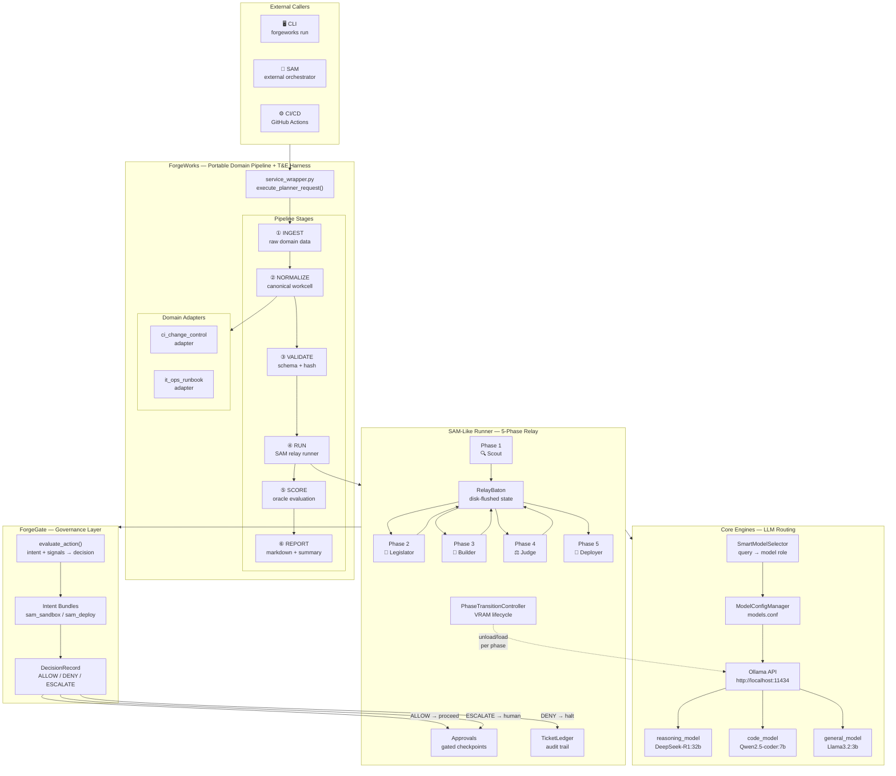
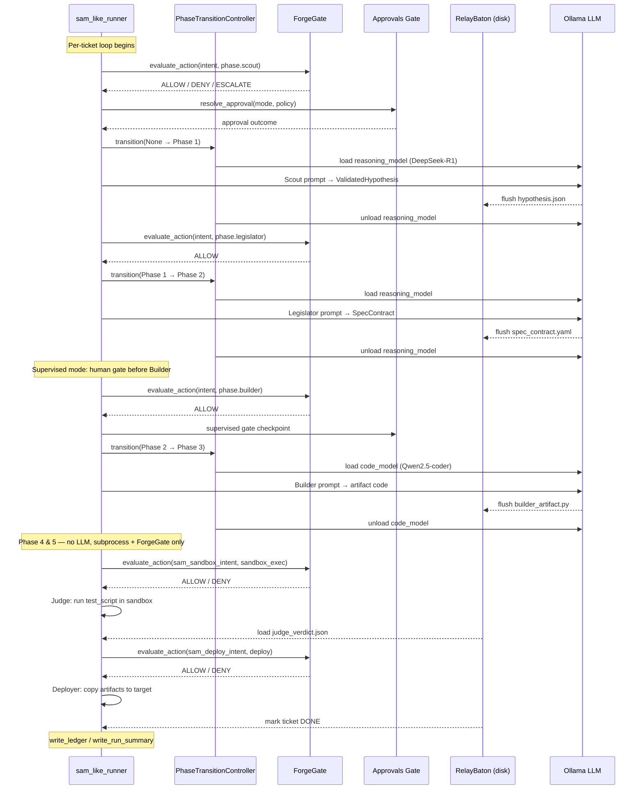
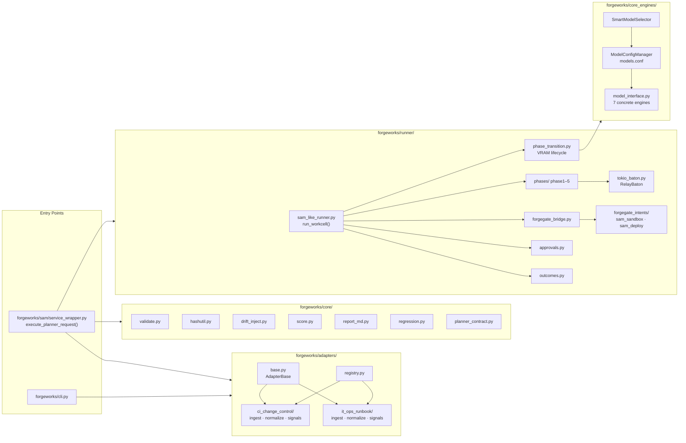

# ForgeWorks — Architecture & Agent Framework

---

## 1. The Three-Layer Mental Model

```
╔══════════════════════════════════════════════════════════════════╗
║                       CALLER LAYER                              ║
║   CLI  ·  SAM orchestrator  ·  GitHub Actions CI/CD             ║
╠══════════════════════════════════════════════════════════════════╣
║                   FORGEWORKS LAYER                              ║
║  Ingest → Normalize → Validate → Run → Score → Report           ║
║                  (the portable T&E pipeline)                    ║
╠══════════════════════════════════════════════════════════════════╣
║        SAM RELAY RUNNER      │       FORGEGATE LAYER            ║
║  Scout→Legislator→Builder    │  evaluate_action()               ║
║  →Judge→Deployer             │  ALLOW / DENY / ESCALATE         ║
║  (the agentic workflow)      │  (the decision boundary)         ║
╠══════════════════════════════════════════════════════════════════╣
║                    CORE ENGINES LAYER                           ║
║  SmartModelSelector → Ollama → reasoning/code/general model     ║
╚══════════════════════════════════════════════════════════════════╝
```

> **SAM** = the agent team pattern
> **ForgeGate** = the intent/governance gate
> **ForgeWorks** = the portable domain pipeline + test harness

---

## 2. System Overview



---

## 3. Full Pipeline Flow

```
  SAM / CLI
     │
     ▼
 execute_planner_request(planner_spec.json)
     │
     │  Gate 1: validate_planner_spec()      ──▶ FAIL → planner_receipt (failure)
     │  Gate 2: path alignment check         ──▶ FAIL → planner_receipt (failure)
     │  Gate 3: ingest()
     │            └─ domain adapter.ingest(raw_source → staged_raw/)
     │  Gate 4: normalize()
     │            └─ domain adapter.normalize(staged_raw → packs/{domain}/)
     │               ┌─ tickets.jsonl
     │               ├─ artifacts.jsonl
     │               └─ signals.jsonl
     │  Gate 5: validate()
     │            └─ jsonschema validation + SHA-256 hash computation
     │  Gate 6: run()
     │            └─ sam_like_runner.run_workcell()
     │               └─ [per ticket] → 5-Phase Relay (see §4)
     │  Gate 7: score()
     │            └─ oracle diff → penalty + total_score + pass/fail
     │  Gate 8: report()
     │            └─ report.md + run_summary.json
     │  Gate 9: build_planner_receipt()
     │
     ▼
  planner_receipt.json  (spec_id, gates_passed, metrics, artifacts)
```

Each gate produces a **structured error receipt** on failure so SAM can handle it programmatically.

---

## 4. The 5-Phase SAM Relay — Per Ticket

```
  ┌──────────────────────────────────────────────────────────────────┐
  │  RelayBaton (disk-flushed JSON — never held in RAM alone)        │
  │  { ticket_id, ticket_intent, current_phase,                      │
  │    hypothesis_path, spec_contract_path, builder_artifact_path,   │
  │    sandbox_directory, judge_verdict_path, phase_timing,          │
  │    retry_count, last_error_log }                                 │
  └──────────────────────────────────────────────────────────────────┘
         │           │           │           │           │
         ▼           ▼           ▼           ▼           ▼

  ╔═══════════╗ ╔═══════════╗ ╔═══════════╗ ╔═══════════╗ ╔═══════════╗
  ║  Phase 1  ║ ║  Phase 2  ║ ║  Phase 3  ║ ║  Phase 4  ║ ║  Phase 5  ║
  ║  SCOUT    ║ ║LEGISLATOR ║ ║  BUILDER  ║ ║   JUDGE   ║ ║ DEPLOYER  ║
  ║           ║ ║           ║ ║           ║ ║           ║ ║           ║
  ║ reasoning ║ ║ reasoning ║ ║   code    ║ ║  no LLM   ║ ║  no LLM   ║
  ║  model    ║ ║  model    ║ ║  model    ║ ║           ║ ║           ║
  ║           ║ ║           ║ ║           ║ ║           ║ ║           ║
  ║ Analyzes  ║ ║ Writes    ║ ║ Generates ║ ║ Runs test ║ ║ Copies    ║
  ║ ticket +  ║ ║ SpecContr ║ ║ artifact  ║ ║ script in ║ ║ verified  ║
  ║ proposes  ║ ║ act YAML  ║ ║ code per  ║ ║ sandbox   ║ ║ artifacts ║
  ║ Validated ║ ║ (rules +  ║ ║ the Spec  ║ ║ → verdict ║ ║ to target ║
  ║ Hypoth.   ║ ║ TDD plan) ║ ║ Contract  ║ ║           ║ ║           ║
  ╚═══════════╝ ╚═══════════╝ ╚═══════════╝ ╚═══════════╝ ╚═══════════╝
        │               │           │             │              │
   ForgeGate       ForgeGate   ForgeGate     ForgeGate      ForgeGate
   evaluate        evaluate    evaluate      sandbox        deploy
   phase.scout     phase.leg.  phase.build   intent         intent
```

**ForgeGate is called before every phase.** The runner only proceeds if the decision is `ALLOW` or
`ALLOW_WITH_MODS`. `DENY` halts the ticket. `ESCALATE` routes to the human approval gate.

---

## 5. 5-Phase Relay Sequence



---

## 6. PhaseTransitionController — VRAM Lifecycle

```
  ❌ WRONG (causes GPU stall):
  ┌────────────────────────────────────────────────┐
  │  Phase 1 loads DeepSeek-R1 (32B) ─── still in VRAM ──┐
  │  Phase 3 loads Qwen-coder (8B)  ─── also in VRAM   ──┤
  │                               both fight GPU → hangs  │
  └────────────────────────────────────────────────────────┘

  ✅ CORRECT (PhaseTransitionController enforces):
  ┌────────────────────────────────────────────────────────────────┐
  │  Phase 1 starts                                                │
  │    └─ load  DeepSeek-R1:32b          VRAM: [DeepSeek]         │
  │    └─ run_scout()                                              │
  │    └─ unload DeepSeek-R1             VRAM: []                  │
  │  Phase 2 starts                                                │
  │    └─ load  DeepSeek-R1:32b          VRAM: [DeepSeek]         │
  │    └─ run_legislator()                                         │
  │    └─ unload DeepSeek-R1             VRAM: []                  │
  │  Phase 3 starts                                                │
  │    └─ load  Qwen2.5-coder:7b         VRAM: [Qwen]             │
  │    └─ run_builder()                                            │
  │    └─ unload Qwen2.5-coder           VRAM: []                  │
  │  Phase 4: Judge   — no model needed  VRAM: []                  │
  │  Phase 5: Deployer — no model needed VRAM: []                  │
  └────────────────────────────────────────────────────────────────┘

  Phase → Model Role Mapping:
  ┌──────────┬──────────────────────┬──────────────────────────────┐
  │ Phase    │ Role                 │ Default Model                │
  ├──────────┼──────────────────────┼──────────────────────────────┤
  │ 1 Scout  │ reasoning            │ deepseek-r1:32b              │
  │ 2 Legis. │ reasoning            │ deepseek-r1:32b              │
  │ 3 Build. │ code                 │ qwen2.5-coder:7b             │
  │ 4 Judge  │ (none — subprocess)  │ —                            │
  │ 5 Deploy │ (none — ForgeGate)   │ —                            │
  └──────────┴──────────────────────┴──────────────────────────────┘
```

---

## 7. Approval & Run Modes

```
  ┌────────────────────────────────────────────────────────────────┐
  │                        DECISION FLOW                          │
  │                                                                │
  │  ForgeGate returns:                                            │
  │  ┌─────────────┬──────────────────────────────────────────┐   │
  │  │ ALLOW       │ proceed (approval may auto-pass by mode) │   │
  │  │ ALLOW_MODS  │ proceed with modifications noted         │   │
  │  │ ESCALATE    │ route to human approval gate             │   │
  │  │ DENY        │ halt ticket immediately, log to ledger   │   │
  │  └─────────────┴──────────────────────────────────────────┘   │
  │                                                                │
  │  Run modes affect approval policy:                             │
  │  ┌────────────┬───────────────────────────────────────────┐   │
  │  │ shadow     │ full run, NO side effects, decisions only  │   │
  │  │ supervised │ human gate required before Builder (write) │   │
  │  │ ramped     │ auto-allow low-risk; gate high-risk only   │   │
  │  └────────────┴───────────────────────────────────────────┘   │
  │                                                                │
  │  Hard-deny policies (always blocked regardless of mode):      │
  │    • approval_bypass                                           │
  │    • disable_tests                                             │
  └────────────────────────────────────────────────────────────────┘
```

---

## 8. Component & Module Map



---

## 9. Disk Artifacts Produced Per Run

```
  results/{run_id}/
  ├── decision_ledger.jsonl        ← every ForgeGate decision, hash-chained
  ├── approval_records.jsonl       ← every approval gate outcome
  ├── run_summary.json             ← aggregate metrics + ticket count
  ├── {ticket_id}/
  │   ├── ticket_outcome.json      ← per-ticket result
  │   ├── {ticket_id}_hypothesis.json       (Phase 1 output)
  │   ├── {ticket_id}_spec_contract.yaml    (Phase 2 output)
  │   ├── {ticket_id}_builder_artifact.*   (Phase 3 output)
  │   └── {ticket_id}_relay_baton.json     (live state)
  ├── score.json                   ← oracle diff, penalties, pass/fail
  └── report.md                    ← human-readable markdown report
```

---

## 10. Domain Adapter Pattern

```
  Raw domain data
       │
       ▼
  AdapterBase (forgeworks/adapters/base.py)
  ┌─────────────────────────────────────────────────┐
  │  .ingest(source_path, staged_path)              │
  │  .normalize(staged_path, out_path) → workcell   │
  └─────────────────────────────────────────────────┘
       │                          │
       ▼                          ▼
  ci_change_control/         it_ops_runbook/
  ├── ingest.py               ├── ingest.py
  ├── normalize.py            ├── normalize.py
  └── signals.py              └── signals.py
  (Engineering change         (IT runbook automation
   control / CI exceptions)    steps + signals)

  → Both produce the same canonical workcell schema:
    tickets.jsonl · artifacts.jsonl · signals.jsonl
```

---

## 11. Component Reference Table

| Concern | Owner | Key File |
|---|---|---|
| Entry point / service contract | `service_wrapper.py` | `forgeworks/sam/service_wrapper.py` |
| Domain data ingestion | Domain Adapters | `forgeworks/adapters/{domain}/` |
| Canonical workcell format | Core / validate | `forgeworks/core/validate.py` |
| 5-phase relay execution | SAM-Like Runner | `forgeworks/runner/sam_like_runner.py` |
| Phase state (disk) | RelayBaton | `forgeworks/runner/tokio_baton.py` |
| Phase agent logic | Phase modules | `forgeworks/runner/phases/phase1–5.py` |
| VRAM lifecycle | PhaseTransitionController | `forgeworks/runner/phase_transition.py` |
| Governance / policy | ForgeGate bridge | `forgeworks/runner/forgegate_bridge.py` |
| Approval gating | Approvals | `forgeworks/runner/approvals.py` |
| LLM routing | SmartModelSelector | `forgeworks/core_engines/selection/` |
| Scoring / evaluation | Score + Oracle | `forgeworks/core/score.py` |
| Determinism / audit | Hashutil + Ledger | `forgeworks/core/hashutil.py` |
| Drift / adversarial | Drift inject | `forgeworks/core/drift_inject.py` |

