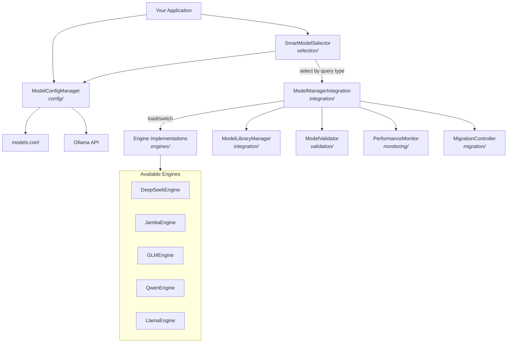

# Core Engines — Reusable Model-Switching Framework

The **Core Engines** module provides a complete framework for managing multiple AI models — selecting, loading, switching, validating, and monitoring them — through a unified architecture.

## Architecture



## Folder Structure

```
CoreEngines/
├── config/
│   ├── model_config_manager.py   # Load/save models.conf, query Ollama, switch models
│   └── models.conf               # Role-based model config (reasoning, code, general, vision, embedding)
├── selection/
│   └── smart_model_selector.py   # Pattern-matching router: query → best model for task
├── engines/
│   └── model_interface.py        # ABCs + 7 concrete engines (DeepSeek, Jamba, GLM, Qwen, Llama, Transformer, Hybrid)
├── integration/
│   ├── model_manager_integration.py  # Singleton bridge + observer pattern for model switches
│   └── model_library_manager.py      # HuggingFace download, catalog, activation
├── validation/
│   └── model_validator.py        # 6-test pre-activation suite
├── migration/
│   └── migration_controller.py   # LoRA backup/invalidation, config state management
├── monitoring/
│   └── model_performance_monitor.py  # Per-model metrics, comparison, alerts
└── reference/
    └── core_engines_ui.py        # Streamlit UI reference implementation
```

## Quick Integration Guide

### Step 1: Configure Models

Edit `config/models.conf` to assign models to roles:

```ini
[llm_model]
provider = "ollama"
api_url = "http://127.0.0.1:11434"
code_model = "qwen2.5-coder:7b"
reasoning_model = "deepseek-r1:32b"
general_model = "llama3.2:3b"
vision_model = "glm-ocr:latest"
smart_selection = true
```

### Step 2: Select a Model by Query Type

```python
from CoreEngines.selection.smart_model_selector import SmartModelSelector

selector = SmartModelSelector()
result = selector.select_model("Write a Python function to sort a list")
print(result.model_name)   # → qwen2.5-coder:7b
print(result.model_type)   # → code
print(result.reason)       # → "Code generation patterns detected"
```

### Step 3: Manage Model Lifecycle

```python
from CoreEngines.config.model_config_manager import get_model_config_manager

manager = get_model_config_manager()

# List available Ollama models
models = manager.get_ollama_models()

# Load a model
manager.load_model("deepseek-r1:32b")

# Switch models (auto-unloads old, loads new)
result = manager.switch_model("qwen2.5-coder:7b", old_model="deepseek-r1:32b")

# Save configuration
manager.save_config({
    'reasoning_model': 'deepseek-r1:32b',
    'code_model': 'qwen2.5-coder:7b',
    'general_model': 'llama3.2:3b',
})
```

## Key Files Explained

| File | Purpose |
|------|---------|
| `model_config_manager.py` | Singleton config manager — reads `models.conf`, queries Ollama `/api/tags`, provides `load_model()`, `unload_model()`, `switch_model()` |
| `smart_model_selector.py` | Routes queries using regex patterns → selects code/reasoning/general/vision model with confidence scores |
| `model_interface.py` | Abstract base classes (`BaseModelEngine`, `ModelInterface`) + concrete engines for DeepSeek, Jamba, GLM, Qwen, Llama |
| `model_manager_integration.py` | Singleton bridge with observer pattern — listeners get notified on model switches |
| `model_library_manager.py` | Downloads models from HuggingFace, manages catalog/metadata, handles activation |
| `model_validator.py` | Validates engines before activation: generation, context handling, tool integration, memory, error handling, performance |
| `migration_controller.py` | Orchestrates engine upgrades: LoRA adapter backup/invalidation, config migration, rollback support |
| `model_performance_monitor.py` | Tracks per-model metrics (inference time, error rate, throughput), supports A/B comparison and alerting |

## Dependencies

- **Core**: Python standard library (`logging`, `configparser`, `re`, `json`, `threading`, `dataclasses`)
- **API**: `requests` (for Ollama HTTP API)
- **Optional**: `huggingface_hub` (for model downloads in `model_library_manager.py`)
- **Optional**: `torch`, `transformers`, `peft` (for `JambaEngine` direct model loading)
